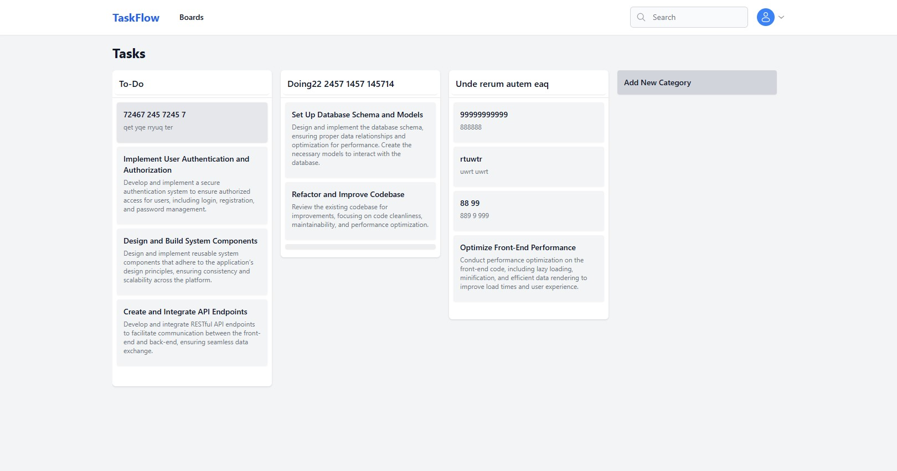

---

## 📸 Screenshot



---
# Frontend Setup for React Project

Follow these steps to set up and run the React frontend locally.

## 1. Clone the Project

Clone the repository to your local machine:

```
git clone https://github.com/hixvmx/taskflow-frontend.git
```

## 2. Install Dependencies

Navigate to the project directory and run:

```
npm install
```

## 3. Create `.env` File

In the root directory, create a `.env` file and add the following environment variables:

```
REACT_APP_ENV=local
REACT_APP_API_URL=http://localhost:8000/
REACT_APP_FRONTEND_URL=http://localhost:9000/
```

## 4. Run the Application

Start the development server:

```
npm start
```

## 5. Visit the Application

Once running, open your browser and go to:

```
http://localhost:9000
```

---

### 🚀 Built by **https://www.hixvm.com**
